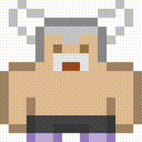

# roguelike-sprite-builder

<!-- badges: start -->

<!-- badges: end -->

An R {shiny} app to help build roguelike character sprites. Runs entirely in the browser thanks to {shinylive}. Work in progress.

Uses [the Roguelike Characters pack (2.0)](https://kenney.nl/assets/roguelike-characters) created and distributed by [Kenney](www.kenney.nl) under a [CC0 license](http://creativecommons.org/publicdomain/zero/1.0/).

